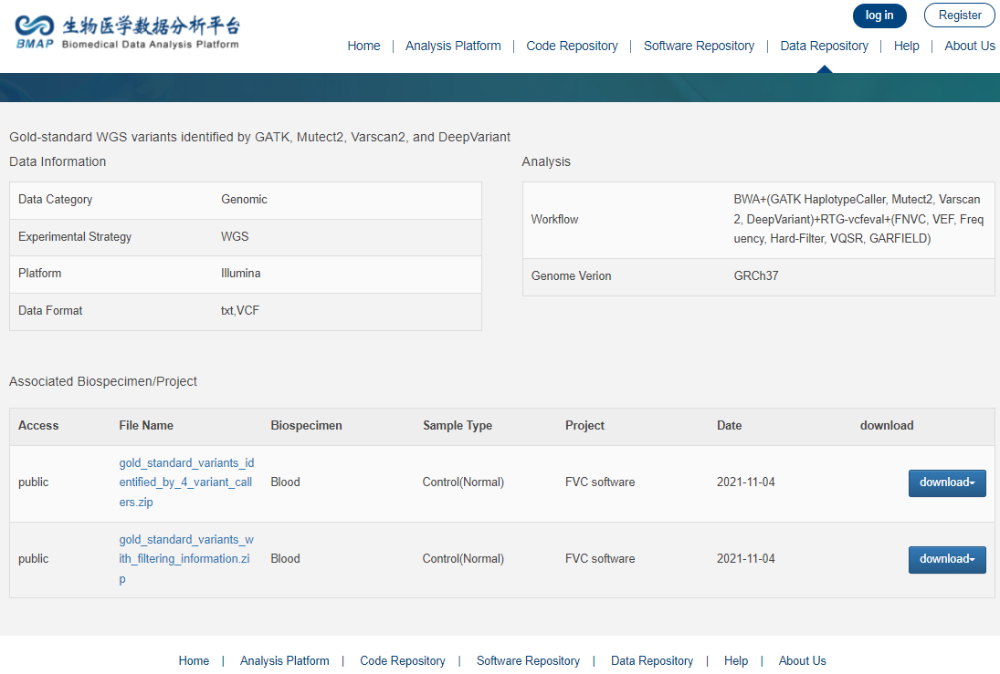

# Training and Testing Data

We provide the training data and testing data to make the results reproducible. By using this released dataset, researchers can further improve the performance with a new binary classification method. 

It is freely available for academic use, but the copyrights of all the data in this paper belong to the original copyright owners or organizations (GIAB). 

Introduction
------------
Sequencing alignment, marking duplicates, and local realignment were performed using the BWA-MEM, Dedup, and Realigner that are integrated into Sentieon. 
The germline variants were identified using GATK HaplotypeCaller(version 4.0.11, with default parameters) and Mutect2 (Integrated in GATK version 4.1.9 with default parameters) Varscan2 (version 2.3.9 with default parameters, except where --min-coverage 3, --p-value 0.10, --min-var-freq 0.01) and DeepVariant (version 1.2, default parameters). 

The variant calling process can be found in the 'Variant Calling/variant_calling.sh' 

The true-positive variants and false-positive variants were defined based on the consistency of the variant calls with the high confident variant calls from NIST’s GIAB consortium (version 3.3.2) using RTG-vcfeval method and regardless of the zygosity differences via setting the argument --squash_ploidy. 

Data
------------
### Leave one individual out cross validation study data
The training and testing data used for the leave one individual out cross validation study are available in the:  
http://bmap.sjtu.edu.cn/datastorage/main/40 
 

The high-confident variants released by GIAB can be download from:  
https://github.com/genome-in-a-bottle/giab_latest_release 

The raw sequencing data used in the paper are available in the:  

https://github.com/genome-in-a-bottle/giab_data_indexes/tree/master/  
