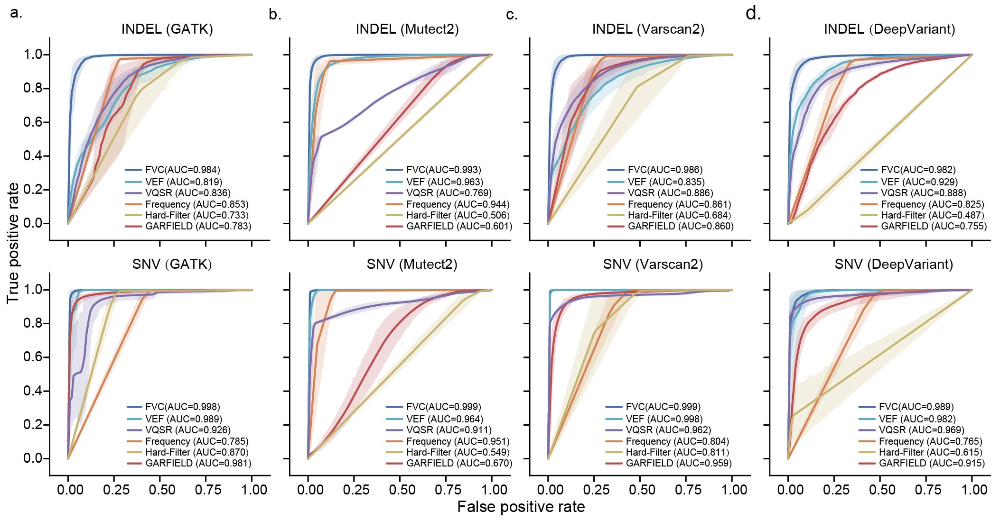
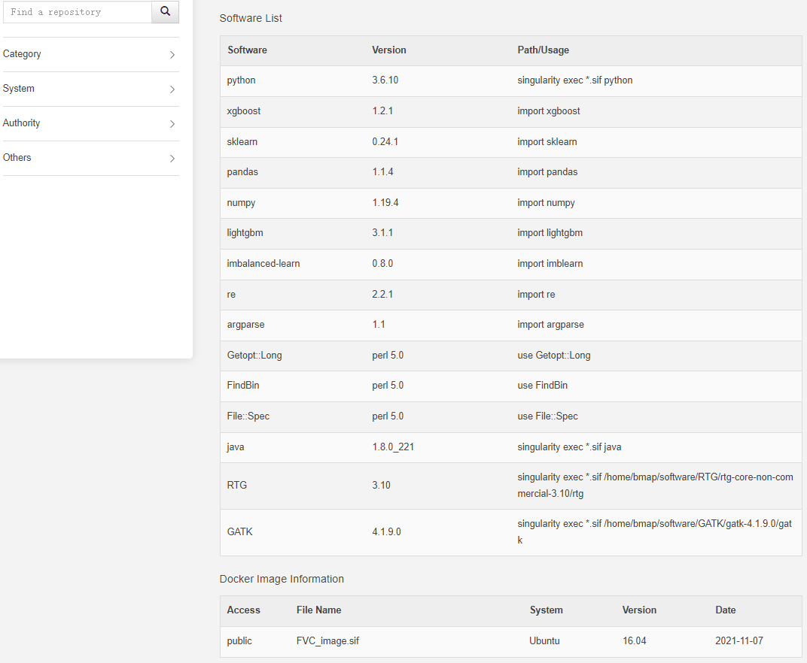
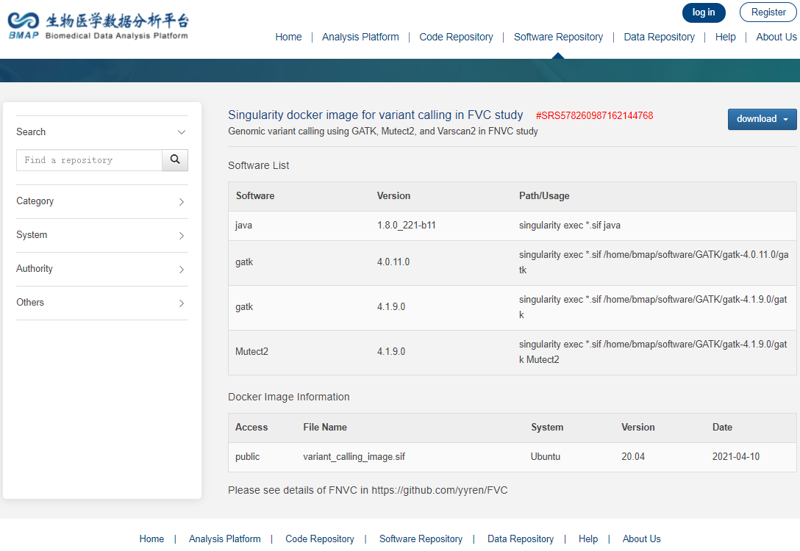
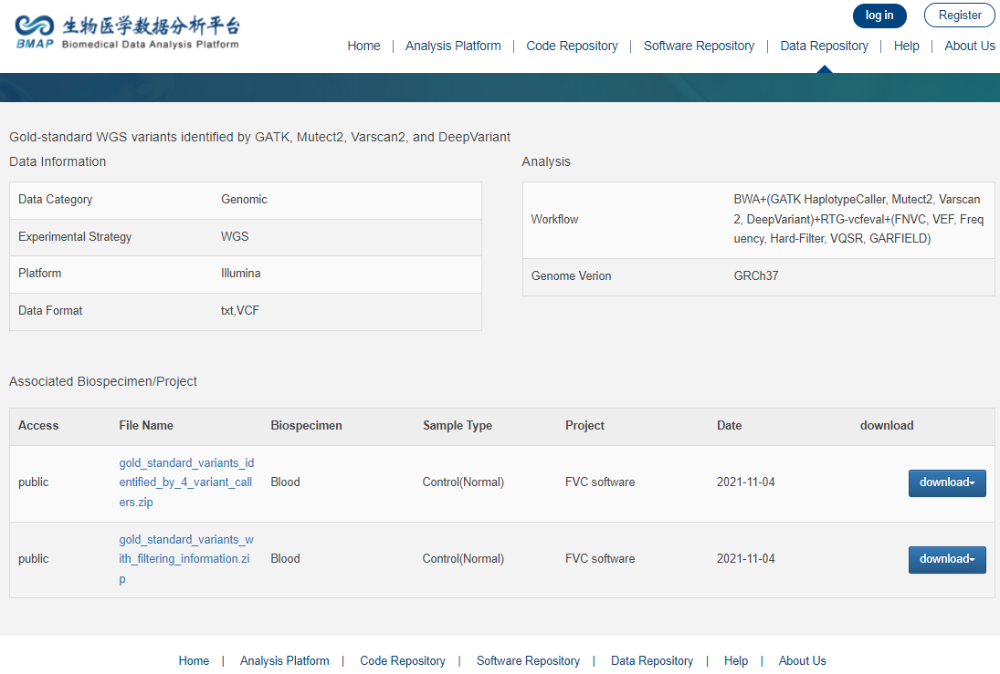

# FVC
FVC: Filtering for NGS variant calls<br>

It is freely available for academic use. However, users should consider the licensing of GIAB database about the original gold-standard variants and sequenced results.<br>

Introduction
------------
  Whole-genome sequencing (WGS) is frequently used in large-scale population genetic research and the medical diagnosis of congenital or acquired disorders. Here, we present FVC, an adaptive method for quality control of whole-genome sequencing variants identified by different variant callers, and test it on the variants identified by GATK HaplotypeCaller, Mutect2, Varscan2, and DeepVariant..<br>
  
  FVC removed far more false variants than the current state-of-the-art filtering methods and recalled ~51-99% true variants filtered out by the others. Moreover, FVC decreased the loss of true variants from 0.05-1661 to 0.02-0.57 per filtering each false variant. Furthermore, it is the only method that consistently eliminates more false-positive variants than the loss of true-positive variants (log OFO <0).<br>

<br>

<br>


Usage
------------
### Filtering (exist pre-trained model)
*** Split VCF file with multiple samples into multiple VCF files with single sample *** <br>
*** (only required for vcf with multiple samples) *** <br>
```bash
perl multi_samples_to_single.pl $in_vcf $outDir
input file: $in_vcf <br>
output files: ${outDir}/${sampleId}.split.vcf <br>
```

**step1. Features construction**<br>
```bash
singularity exec FVC_image.sif bash ${absolute_path}/Features_construction.sh \
    -i ${absolute_path}/input.vcf \
    -b ${absolute_path}/input.bam \
    -r ${absolute_path}/hg1kv37.fa \
    -t 40 \
    -p ${absolute_path}/out_snv.record \
    -q ${absolute_path}/out_indel.record
```

-t: cpu cores (about 23min/40cores  for each WGS VCF file), we suggest use as many as you can in this step. <br>
-r: the human refSeq used for read alignment. <br>
The 'input_raw_file.vcf' contains the variants derived from the reads aligned file 'input.bam'. <br>


**step2. Filtering**<br>
```bash
singularity exec FVC_image.sif bash ${absolute_path}/Supervised_learning_filtering.sh \
    -f filter
    -i ${absolute_path}/input.vcf \
    -o ${absolute_path}/input_filtered.vcf \
    -p ${absolute_path}/out_snv.record \
    -q ${absolute_path}/out_indel.record \
    -m ${absolute_path}/snv.model \
    -n ${absolute_path}/indel.model
```

pre-trained models: '-m': snv.model; '-n': indel.model <br>

### Adapt to specified variant caller
**step1. Constructing training data and features** <br>
```bash
singularity exec FVC_image.sif bash ${absolute_path}/Data_construction.sh \
    -i ${absolute_path}/config.json \
    -t 40
```

**Required** <br>
1 Training data: raw VCF and BAM files generated <br>
2 gold-standard files: high-confident variants (VCF file) and the sequencing regions (bed file) <br>
3 human reference seq: fasta format file <br>

*Example of config.json* <br>
```json
{
    "data": [
        {
            "unfiltered_VCF": "HG001_gatk.vcf",
            "BAM_file": "HG001_aligned.bam",
            "goldStandard_VCF": "HG001_highConfidence.vcf",
            "goldStandard_bedFile": "HG001_highConfidence_region.bed"
        },
        {
            "unfiltered_VCF": "HG002_gatk.vcf",
            "BAM_file": "HG002_aligned.bam",
            "goldStandard_VCF": "HG002_highConfidence.vcf",
            "goldStandard_bedFile": "HG002_highConfidence_region.bed"
        }
    ],
    "refSeq": "/data/refSeq/hg19.fa",
    "outDir": "/data/output"
}
```
**step2. Supervised learning** <br>
```bash
singularity exec FVC_image.sif bash ${absolute_path}/Supervised_learning_filtering.sh \
    -f train \
    -a ${outDir}/Training_tp_snv.record \
    -b ${outDir}/Training_fp_snv.record \
    -c ${outDir}/Training_tp_indel.record \
    -d ${outDir}/Training_fp_indel.record \
    -j ${outDir}/pipeline_adapted_snv.model \
    -k ${outDir}/pipeline_adapted_indel.model
```
output models: *${prefix_name}.snv.model* and *${prefix_name}.snv.model* <br>

**step3. Filtering** <br>
Same with ***Filtering (exist pre-trained model)*** step1-2

Computational Environment
------------
Users can download the singularity image from our docker image sofware responsibility<br>

### FVC Docker image
The FVC_image.sif can be downlaod from http://bmap.sjtu.edu.cn/softstorage/details/31

<br>

OR manually install the requirements with the version equal or later:<br>

### Manually install

##### Python Requirements
* python v3.6.10
* xgboost v1.1.1
* scikit-learn v0.23.0
* pandas v1.0.4
* numpy v1.18.4
* lightgbm v3.1.0
* imbalanced-learn v0.7.0
* re v2.2.1
* argparse v1.1
* os 
* collections 
* math
* itertools
* datetime
* sys

##### Perl Requirements
* perl v5.0
* Getopt::Long
* FindBin
* other customized models (###.pm) are released in FVC folder

##### Java Requirements
* jdk1.8

##### Other
GATK(version 4.1.9)

### Docker image for variant calling
http://bmap.sjtu.edu.cn/softstorage/details/21

<br>

Training and testing data
------------
Sequencing alignment, marking duplicates, and local realignment were performed using the BWA-MEM, Dedup, and Realigner that are integrated into Sentieon.<br>
The germline variants were identified using GATK HaplotypeCaller(version 4.0.11, with default parameters) and Mutect2 (Integrated in GATK version 4.1.9 with default parameters) and Varscan2 (version 2.3.9 with default parameters, except where --min-coverage 3, --p-value 0.10, --min-var-freq 0.01).<br>

The variant calling process can be found in the 'Variant Calling/variant_calling.sh'<br>

The true-positive variants and false-positive variants were defined based on the consistency of the variant calls with the high confident variant calls from NIST’s GIAB consortium (version 3.3.2) using RTG-vcfeval method and regardless of the zygosity differences via setting the argument --squash_ploidy.<br>

The details of the data can be found in the folder 'Data for Training and Testing'.<br>

### Leave one individual out cross validation study data
The training and testing data used for the leave-one-individual-out cross-validation study are available in the: <br>

http://bmap.sjtu.edu.cn/datastorage/main/40<br>
<br>

### High-confident variants in vcf format

The high-confident variants released by GIAB can be download from: <br>

https://github.com/genome-in-a-bottle/giab_latest_release <br>

### High-confident variants in fastq or bam format
The raw sequencing data used in the paper are available in the: <br>

https://github.com/genome-in-a-bottle/giab_data_indexes/tree/master/ <br>
